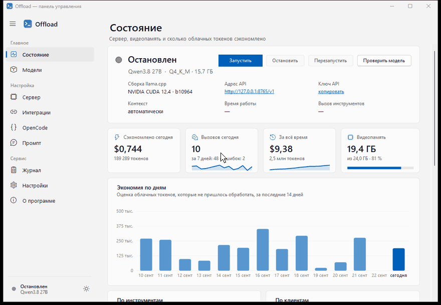

# Offload

[Русский](README.md) · **English**

[](https://github.com/Kelll31/offload/releases/latest)
[](https://github.com/Kelll31/offload/actions/workflows/build.yml)
[](LICENSE)


**A local assistant model for Claude Code and other IDEs.** Offload is a Windows tray application that installs [llama.cpp](https://github.com/ggml-org/llama.cpp) on its own, downloads a coding model, sets up the [OpenCode](https://opencode.ai) agent, and connects to your IDEs as an MCP server. Claude Code (as well as Cursor, VS Code, Codex, Gemini CLI and others) gets a set of tools it can use to **offload routine work to a free local model** and spend fewer cloud tokens.

No Docker, WSL, Python or Node.js — a single `Offload.exe`, everything installs into the user profile without administrator rights.

<p align="center">
  
</p>

**[⬇ Download the latest version](https://github.com/Kelll31/offload/releases/latest)** · Open source under the MIT license — [join in](#open-source-and-contributing)

## Why it matters

The most expensive tokens in a cloud agent's work are:

1. **reading large files and logs** — every file read stays in context and gets re-read on every following step;
2. **writing code** — output tokens cost 5x more than input tokens.

Offload takes both off the cloud model's plate:

- the server **reads files itself** and gives the cloud model only a short answer (a question about 2000 lines of code costs ~800 tokens instead of ~20,000);
- the server **writes files to disk itself** (tests, DTOs, boilerplate, mechanical edits) and returns only a summary: how many lines, whether the check command passed;
- answers are compact and note how many cloud tokens were saved. Overall stats are in the "Status" window.

Planning, architecture, hard debugging and the final review stay with Claude — the MCP server's instructions tell it directly what to delegate and what not to.

## Features

- **Setup wizard** (Russian / English): detects the GPU, VRAM size, driver and RAM, and picks an llama.cpp build (CUDA 12/13, Vulkan, ROCm, SYCL, CPU) and a model that fits.
- **Main model — Qwen3.8-27B** (best code quality among local models): Q6 for 32+ GB VRAM, Q4 for 24 GB, IQ3 for 16 GB. For weaker cards, the wizard suggests fast MoE models (Qwen3.6-35B-A3B, Ornith) and 9B models.
- **Catalog of current models** (Qwen3.8/3.6/3.5, Ornith, gpt-oss, Qwen3-Coder-Next, Devstral, and others) with exact files, SHA-256 checksums and a "will it fit in VRAM" estimate. MoE models automatically offload part of the experts to RAM — a 35B model runs even on 8-12 GB of VRAM.
- **Resumable download** with checksum verification; you can also add your own GGUF file.
- **llama-server managed by the tray app**: autostart, restart on failure, model unload when idle, log, VRAM status.
- **OpenCode** is installed and configured automatically to use the local model — for multi-step agent edits.
- **One-click IDE connection**: Claude Code, Claude Desktop, Cursor, VS Code (Copilot), Copilot CLI, Windsurf/Devin, Cline, Roo Code, Kilo Code, Zed, Gemini CLI, OpenAI Codex, JetBrains Junie, Continue, Visual Studio, Kiro, Trae, Qoder. Configs are edited carefully (with a backup and comments preserved).
- **For Claude Code** additionally: a skill with delegation rules, an optional "strict" rule, a subagent, and permissions for read tools without confirmation.
- **Security**: the server listens only on `127.0.0.1` with an API key; MCP tools don't read secrets (`.env`, keys, certificates), only write inside the working folder, check commands come only from an allowlist; any edit can be rolled back.
- The tray interface and all windows are **in Russian or English** (switches on the fly), light/dark theme, ready-made color schemes and a custom accent color.

### App settings

The **"Settings"** section of the main window (or "Settings…" in the tray icon menu):

- **Setup wizard** — "Open setup wizard" button (same as "Setup wizard…" in the tray menu): re-pick the llama.cpp build and model, reinstall components, connect IDEs.
- **Appearance** — theme (as in Windows / light / dark), color scheme (blue, teal, green, purple, orange, pink, "Midnight", high contrast) or a custom accent color.
- **Language** — Russian, English or as in Windows; changes immediately, no restart needed (also selectable on the wizard's first step).
- **Models** — folder for new models (already-downloaded ones stay in place and keep working).
- **Startup and notifications** — start with Windows, popup notifications, minimize to tray on window close.
- **App data** — open the data folder and `config.json`.

## MCP tools

24 tools in five groups. Anything that can be done deterministically (search, symbols, diagnostics, scanners, patches) the server
does itself, without the model and in seconds; the local model kicks in where "judgment" is needed: answering questions about files, expanding a query,
review, plans, log analysis, writing code.

**Context and navigation** — instead of dozens of `Glob`/`Grep`/`Read` calls in the cloud context:

| Tool | What it does | Modifies files |
|---|---|---|
| `local_find_context` | A task in natural language (including Russian) → the server finds and ranks files, classes and methods itself, explains its choices and fits the code into a token budget; `mode=plan` adds an implementation plan | no |
| `local_project_map` | Repository map: projects and their links, languages, entry points, test projects, build/test commands; `routes`, `config`, `env`, `cli`, `ci`, `docker`, `rules` (CLAUDE.md/AGENTS.md…), `conventions` (style and conventions) sections | no |
| `local_search_code` | Search by text / regex / word / file name with short snippets | no |
| `local_symbols` | Outline, definition, references, implementations, call graph (callers/callees with depth), tests for a symbol, public API, body of a single function | no |
| `local_ask_files` | Answer a question about files/folders/globs that the server reads itself | no |
| `local_git_history` | File/symbol history (`git log -L`), blame summary by commit, related commits, changelog and release notes, "why the code is this way" | no |
| `local_memory` | Project memory across sessions: facts, decisions (mini-ADRs), conventions | no (stored in Offload's data folder) |

**Checks and analysis:**

| Tool | What it does | Modifies files |
|---|---|---|
| `local_verify` | Build/test/lint/format (an allowlisted command or `kind` — inferred from the project): in the IDE — only the outcome, structured errors, stack frames from the project's code and root-cause analysis; the full log goes to `.offload/runs/` | no (except build artifacts) |
| `local_diagnostics` | Compiler/linter errors as data (MSBuild, tsc, eslint, gcc/clang, rustc, go, mypy/ruff) with symbol and code line; stack trace → file, function, line | no |
| `local_summarize_log` | Digest of a large log; with `pattern` — find events by request/task id without the model | no |
| `local_impact` | What a change affects: symbols, callers, related tests, projects; `run_tests` — run only the related tests | no |
| `local_code_scan` | TODOs, leaked secrets (values are masked), dangerous APIs, async issues, dead code, duplicates, complexity, hot spots (complexity × change frequency), generated files | no |
| `local_review_diff` | First-pass review of a `git diff` / branch | no |
| `local_security_review` | Security check of only the changed code: rules + model review | no |
| `local_dependency_check` | Packages: list, graph and "why A depends on B", licenses (offline), unused, outdated and vulnerable (via registries) | no |

**Writing code** — all with a snapshot for rollback (`local_job action=revert`):

| Tool | What it does | Modifies files |
|---|---|---|
| `local_solve` | The whole cycle in one call: context → brief to the agent by task type (feature / bug / refactor / tests / issue) → edits in a git sandbox → check with fixes → review → merge → **proof of the result** (files, check, diagnostics, review findings, open questions) | yes (after checking) |
| `local_agent_task` | A task for the local OpenCode agent in a **git sandbox** with an "autonomy budget" (`allowed_paths`, `max_files`, time, fix rounds, review before merge); can run in the background | yes (after checking) |
| `local_apply_patch` | Unified diff applied atomically: all hunks are verified upfront (resilient to line shifts and CRLF), encoding is preserved, check and auto-rollback | yes |
| `local_refactor` | `rename` a symbol across all references (including renaming the file, conflict checking and auto-rollback); `extract_method` / `extract_class` / `move_symbol` / `inline` / `change_signature` — via the agent in a sandbox | yes |
| `local_write_file` | New file per spec (tests, DTOs, fixtures, documentation) + a check command | yes |
| `local_edit_files` | Mechanical edit of a list of files + check | yes |
| `local_commit_message` | Commit message, PR description (`kind=pr`) or a plan to split a large diff into commits (`kind=split`) | no |

**Utility:** `local_job` — task list, status (with waiting for a background one), diff, sandbox merge/delete, cancel, rollback;
`local_status` — model status, speed, token savings.

**MCP protocol:** besides text, `local_verify`, `local_diagnostics`, `local_impact` and `local_status` return `structuredContent`
matching a declared `outputSchema` (the IDE reads the outcome without regexes). Long output is served as resources and linked from
results with `resource_link`: `offload://runs/<id>` (full run log), `offload://jobs/<id>/diff` (job diff), `offload://project/map`
(project overview), `offload://memory` (project memory); reads go through the same path checks and secrets are masked. If the IDE
supports elicitation, Offload asks the user before risky steps: `local_job merge` of a job held back by `max_files` or critical/high
review findings, `local_job revert force=true` over later edits, and `local_verify` with a command outside the allowlist ("allow
once"; the list is not changed); without elicitation nothing changes. Map-reduce progress carries `total`, and prompt arguments
have completions (`kind`, paths).

In Claude Code the tools are called `mcp__offload__<name>`. Example request: *"use offload: find where the discount is calculated
and fix the rounding bug — with a test"* → `local_find_context` + `local_solve kind=bug`.

### Local agent git sandbox

`local_agent_task` doesn't touch your files while the agent works: the working folder (including uncommitted and new files, except secrets)
is captured in a temporary index as a snapshot commit, and a `git worktree` is created from it in `%LOCALAPPDATA%\Offload\sandboxes\`.
Your index, HEAD and branches don't change. If the project isn't under git, Offload sets up a hidden "shadow" repository in its own data folder —
no `.git` appears in the project itself. Changes are carried over into the project only if the check passes and the patch applies without conflicts;
a snapshot of the files is taken before writing, so `local_job action=revert` undoes the merge. Secrets, symlinks and files
outside the working folder (and outside `allowed_paths`) are not carried over from the sandbox; the merge is blocked if the check fails, more than
`max_files` files were changed, or the local model's review found critical/high issues — then the work waits for a decision on the branch
(`local_job action=diff` → `merge` / `discard`).

### How search and navigation work

The code index is built on the fly (respecting `.gitignore`, excluding secrets and binary files) and cached in the MCP server process by
file size and modification time, so repeated calls within a session are fast. Symbols are parsed heuristically (regular
expressions + bracket counting, indentation for Python) for C#, TypeScript/JavaScript, Python, Go, Java, Kotlin, Rust, C/C++, Pascal/Delphi,
PHP, Ruby and Swift — without a compiler or language server. References and the call graph are text-based: same-named members of different types aren't distinguished,
so results are worth double-checking before important decisions (the tools say so directly).

### Slash commands (MCP prompts)

The server publishes ready-made scenarios; in Claude Code they're available as `/mcp__offload__<name>`:

| Command | What it does |
|---|---|
| `delegate` | Hand a coding task to the local agent (sandbox + check) and verify the result |
| `review` | Two-pass review: the local model finds issues, Claude confirms each finding |
| `tests` | Tests for a file, written by the local model until they pass |
| `fix_build` | Run the build/tests, parse the errors and fix them (mechanical fixes go to the agent) |
| `explain` | Explain code by paths/globs without reading it into context |
| `solve` | Solve the task end to end with the local pipeline and check the proof of the result |
| `context` | Gather context for a task: project memory → `local_find_context` → symbols |
| `security` | Security check of the current changes (rules + model), Claude confirms the findings |

## Installation

1. Download `Offload-Setup-<version>.exe` (or just `Offload.exe`) from the [Releases](https://github.com/Kelll31/offload/releases) page.
2. Run it — the setup wizard opens. It suggests an llama.cpp build and model for your hardware, downloads everything needed and connects the IDEs it finds.
3. Restart Claude Code (or run `/mcp`) — the `offload` server appears.

Requirements: Windows 10 1809+ / Windows 11 x64, preferably an NVIDIA/AMD/Intel GPU with 8+ GB VRAM (also works on CPU, but slowly), 10-30 GB of free space for the model. llama.cpp builds need the Visual C++ Redistributable — the wizard installs it itself (a UAC prompt will appear).

### Manual setup for any IDE

```json
{
  "mcpServers": {
    "offload": {
      "command": "C:\\Users\\<you>\\AppData\\Local\\Programs\\Offload\\Offload.exe",
      "args": ["--mcp"]
    }
  }
}
```

The exact path and ready-made JSON are on the "Integrations" tab — the "Copy" button.

## Where things live

| Path | What |
|---|---|
| `%LOCALAPPDATA%\Programs\Offload\Offload.exe` | the app (when installed via the installer) |
| `%LOCALAPPDATA%\Offload\config.json` | settings |
| `%LOCALAPPDATA%\Offload\llama.cpp\` | llama.cpp build |
| `%LOCALAPPDATA%\Offload\models\` | GGUF models (the folder can be changed) |
| `%LOCALAPPDATA%\Offload\opencode\` | OpenCode and its isolated configuration |
| `%LOCALAPPDATA%\Offload\logs\` | app, llama-server and MCP logs |
| `%LOCALAPPDATA%\Offload\usage.jsonl` | usage and savings statistics |
| `%LOCALAPPDATA%\Offload\jobs\` | write/edit task snapshots for rollback (kept for `JobRetentionDays` days) |
| `%LOCALAPPDATA%\Offload\sandboxes\` | the local agent's git sandboxes (worktrees) and shadow repositories for projects without git |
| `%LOCALAPPDATA%\Offload\memory\` | project memory (`local_memory`) |
| `<project>\.offload\runs\` | full `local_verify` / `local_diagnostics` logs (the folder excludes itself from git) |

The `OFFLOAD_HOME` environment variable relocates the data folder (portable mode).

## Building from source

Requires [.NET SDK 10](https://dotnet.microsoft.com/download/dotnet/10.0).

```powershell
.\scripts\build.ps1              # tests + publish\Offload.exe (self-contained, ~60 MB)
.\scripts\build.ps1 -Installer   # + installer dist\Offload-Setup-<version>.exe (needs Inno Setup 6 or 7)
```

Checking the MCP server without an IDE:

```powershell
node scripts\mcp-smoke.mjs .\publish\Offload.exe local_status '{}'
```

### Solution structure

| Project | Purpose |
|---|---|
| `Offload.Core` | paths, settings, log, resumable downloader, hardware detection, IPC, statistics |
| `Offload.Llama` | llama.cpp releases, installation, llama-server management, OpenAI-compatible API client |
| `Offload.Models` | model catalog, VRAM estimation, Hugging Face, GGUF reading |
| `Offload.OpenCode` | installation and isolated setup of OpenCode, non-interactive agent runs |
| `Offload.Integrations` | registering the MCP server in IDEs, Claude Code skill and permissions |
| `Offload.Mcp` | stdio MCP server (`Offload.exe --mcp`) and delegation tools |
| `Offload.App` | tray, control panel, setup wizard (WinForms, Russian and English UI) |

## Open source and contributing

Offload is an open-source project under the [MIT](LICENSE) license: free to use, study, modify
and distribute, including in commercial projects. Any help is welcome — from a bug report to a new tool.

**How you can help:**

- **Report a bug or suggest an idea** — in [Issues](https://github.com/Kelll31/offload/issues). For a bug, include the Offload
  version, your GPU and a log excerpt (`%LOCALAPPDATA%\Offload\logs\`), with API keys removed.
- **Test on your hardware** — AMD, Intel Arc, laptops, running without a GPU: tell us which model and llama.cpp build
  worked and how many tokens per second you got.
- **Add a model to the catalog** — `src/Offload.Models/catalog.json`: a pinned Hugging Face revision, sizes, SHA-256, a description
  in Russian and English.
- **Support a new IDE or agent** — an entry in `src/Offload.Integrations/Clients/KnownIntegrations.cs` (config path, format,
  key container).
- **A new MCP tool** — a declaration in `src/Offload.Mcp/OffloadTools.cs`, an implementation in `src/Offload.Mcp/Tools/`, tests
  in `tests/Offload.Mcp.Tests`. Files only through `PathGuard`, commands only through the `VerifyCommand` allowlist.
- **Translation** — the UI is in Russian and English; dictionaries live in `src/Offload.Core/Localization/en/*.json` (the key is the Russian text).
  A new language can be added too.
- **Documentation** — README, IDE setup examples, usage scenarios.

**How to submit changes:**

1. Fork the repo and branch off `main`.
2. Build and run the tests: `dotnet test --solution Offload.slnx -c Release` (the regular run works offline, without a GPU).
3. Follow the project's conventions:
   - by project convention, code comments and UI source strings are in Russian (English translations live under `Localization/en`) — see [CONTRIBUTING.md](CONTRIBUTING.md) for details;
   - every UI string goes through `L.T` / `L.F` with an English translation (checked by the `LocalizationCoverageTests` test);
   - MCP tool descriptions are in English.
4. Open a Pull Request and briefly describe what changed and why. For UI changes, attach a screenshot.

If you're not sure where to start, open an Issue with a question and we'll help. For security issues, see [SECURITY.md](SECURITY.md).

## Uninstalling

Remove the app via "Settings → Apps". The uninstaller disconnects Offload from all IDEs and asks whether to delete downloaded models.

## License

Offload's code is distributed under the [MIT](LICENSE) license.

### Third-party licenses

llama.cpp (MIT) and OpenCode (MIT) are downloaded from their official release pages. Models are distributed under their own licenses (Apache-2.0, MIT, etc.) — listed in the catalog.
